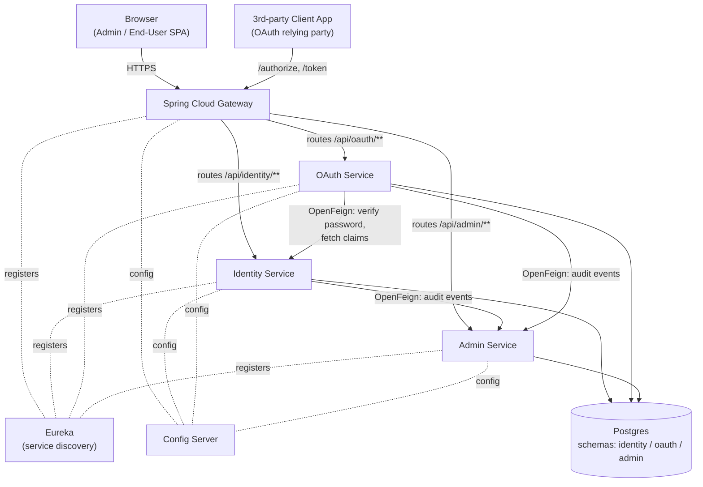
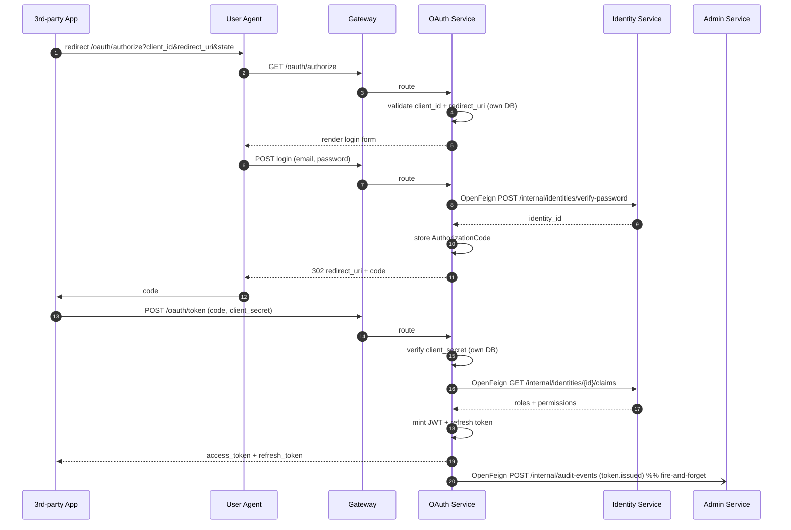

# SW-IDP — Microservices Architecture

Minimum-viable microservices split for the PoC. Microservices is a hard requirement, so we don't go monolith — but everything that doesn't earn its keep (event bus, per-service DB, KMS, service mesh) is cut. If we need any of it later, the boundaries below are drawn so it can be added without a rewrite.

> **Stack lives in `design/STACK.md`.** This doc covers boundaries, data ownership, and how services talk. It does not restate which framework / build tool is used.

## 1. Three services

| # | Service | Owns (from ERD) | Why this boundary |
|---|---|---|---|
| 1 | **Identity Service** | `Identity`, `Session`, `Role`, `Permission`, `IdentityRole`, `RolePermission` | "Who you are, and what you're allowed to do." Login/register, RBAC — all tightly coupled around a user, so they live together. |
| 2 | **OAuth Service** | `ClientApplication`, `RedirectUri`, `AuthorizationCode`, `AccessToken`, `RefreshToken` | The `/authorize` + `/token` hot path plus everything it needs (clients, redirect URIs, token lifecycle). Independently scalable later. |
| 3 | **Admin Service** | `AuditLog`, `SystemSetting` | Low-traffic admin-only concerns that the other two shouldn't own. Audit sink lives here so no service logs audits into its own DB. |

Plus the **React SPA** (the ported Stitch UI), which talks **only** to the **Spring Cloud Gateway**. The Gateway is the single ingress for the SPA and for OAuth third-party traffic. There is no Next.js BFF.

Service discovery is provided by **Eureka**; centralised config by **Spring Cloud Config Server**. See `STACK.md`.

## 2. System diagram



## 3. Data — one Postgres, three schemas

Each service writes only to its own schema:

- `identity.*` — identities, sessions, roles, permissions, identity_roles, role_permissions
- `oauth.*` — client_applications, redirect_uris, authorization_codes, access_tokens, refresh_tokens
- `admin.*` — audit_logs, system_settings

Cross-schema IDs (e.g. `oauth.access_tokens.identity_id` points at `identity.identities.id`) are **carried by value, no foreign keys**. When we need full DB isolation later, we give each schema its own instance and change nothing else.

## 4. How services talk

**Everything is synchronous HTTP + JSON.** No event bus, no queues.

- **SPA → backend**: every request goes through the Gateway (`/api/identity/**`, `/api/oauth/**`, `/api/admin/**`). The Gateway forwards to the right service via Eureka discovery. The SPA gets a short-lived session cookie from Identity at login (issued through the Gateway).
- **OAuth third-party traffic**: `/oauth/authorize` and `/oauth/token` are also published by the Gateway and routed to the OAuth Service.
- **OAuth → Identity** (server-side, OpenFeign): two calls in the code flow — `POST /internal/identities/verify-password` and `GET /internal/identities/{id}/claims` (roles + permissions to embed in the JWT).
- **Identity → Admin** and **OAuth → Admin** (OpenFeign): `POST /internal/audit-events` after any state change. Best-effort — if Admin is down, the caller logs the event to stdout and continues. Audit gaps are tolerated in the PoC.

Service-to-service auth on internal endpoints: a shared internal secret in a header (`X-Internal-Auth: <secret>`), value pulled from Config Server. No mTLS, no JWT mint, no service mesh.

## 5. OAuth authorization code flow

The Gateway is the single ingress for both browser and third-party traffic. **PKCE is not supported** in this PoC — the code flow uses `client_secret` confidential clients only.



## 6. Deployment — one docker-compose

```yaml
# infra/docker-compose.yaml (sketch)
services:
  postgres:         # single instance, three schemas
  config-server:    # Spring Cloud Config Server
  eureka:           # Eureka server
  gateway:          # Spring Cloud Gateway (single ingress)
  identity:         # Spring Boot
  oauth:            # Spring Boot
  admin:            # Spring Boot
  web:              # Vite dev server (dev only) — talks to gateway by compose hostname
```

Eight containers in dev. In a deployed environment the SPA ships as static assets behind the Gateway; the `web` dev container goes away.

## 7. Repo layout

See `design/STACK.md` for the canonical layout. In summary:

```
SW-IDP/
├── apps/
│   └── web/                  # Vite + React SPA
├── services/
│   ├── identity-service/
│   ├── oauth-service/
│   ├── admin-service/
│   ├── gateway/
│   ├── eureka/
│   └── config-server/
├── packages/
│   └── shared-types/         # OpenAPI-derived TS types for the SPA
├── pom.xml                   # Maven parent
├── infra/
│   └── docker-compose.yaml
└── design/
```

Each Spring Boot module owns its own Flyway migrations under `src/main/resources/db/migration/`.

## 8. What we're deliberately not doing, and when to add it back

| Cut | Why we're not doing it now | When to add it |
|---|---|---|
| Event bus (NATS/Kafka) | Sync `POST /internal/audit-events` over OpenFeign is 5 lines | When a second consumer of service events appears (e.g. metrics, webhooks to client apps) |
| DB per service | One Postgres keeps ops trivial; schema-per-service preserves the boundary | When one service's write load affects another, or for strict isolation/compliance |
| KMS / Vault for signing keys | JWT keypair injected via Config Server; JWKS served from a static file per OAuth pod | Before production, always. In PoC, no. |
| Service mesh / mTLS | Shared-secret header is enough inside one compose network | When services run across trust boundaries |
| Distributed tracing | stdout logs + a `request_id` header is enough for three services | When debugging a flow takes more than a grep |
| RBAC as its own service | Lives inside Identity — it's always called alongside identity lookups | When evaluation becomes hot enough to scale independently |
| Access Policies | Folded into role management (`roles-ui` + identity-service role assignment); see `STACK.md` | If a richer rule engine is ever needed, model it on top of `Permission` |
| PKCE | Confidential clients only for the PoC; see `STACK.md` | When public clients (SPA / mobile RP) are added |

## 9. Open questions

1. ~~**Language.**~~ **Resolved:** Java 21 + Spring Boot 3 on the backend, React + Vite + TypeScript on the frontend. See `STACK.md`.
2. **Admin session model.** **Resolved:** opaque server-side session backed by the `Session` entity. Cookie issued by Identity Service through the Gateway.
3. ~~**PKCE.**~~ **Resolved: dropped from the PoC.** Confidential clients only. See `STACK.md` ("Out of scope").
4. **Password rules / lockout.** Implemented in Identity, but the values are pulled from `SystemSetting` rows owned by Admin (Admin owns the settings table; Identity reads them via OpenFeign on startup + cache).
