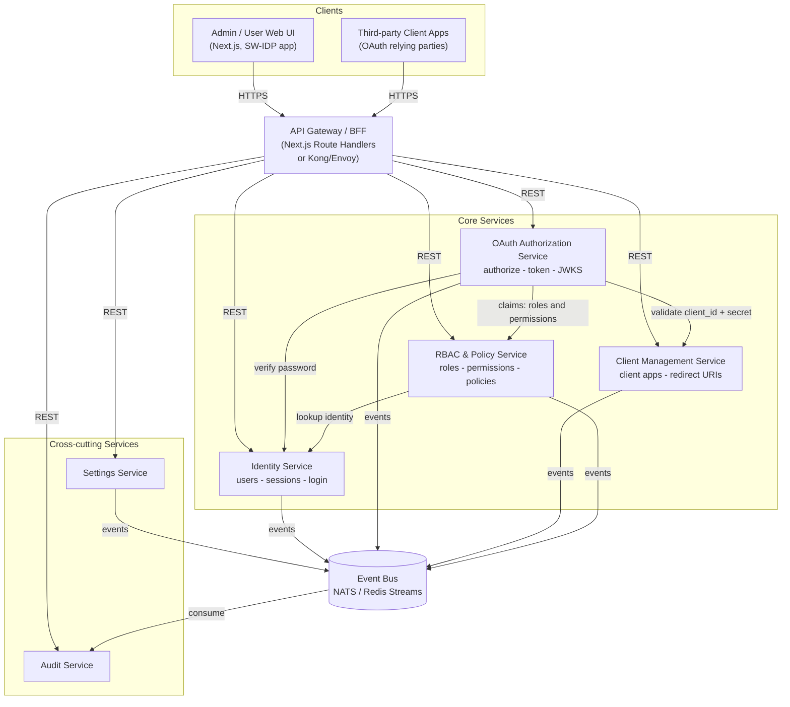
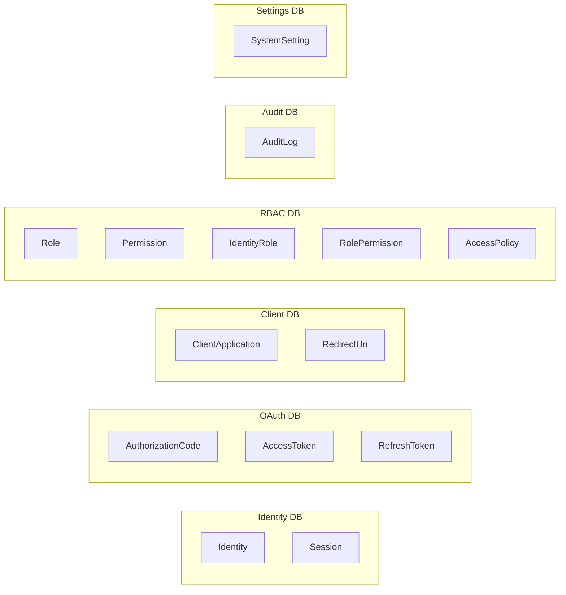
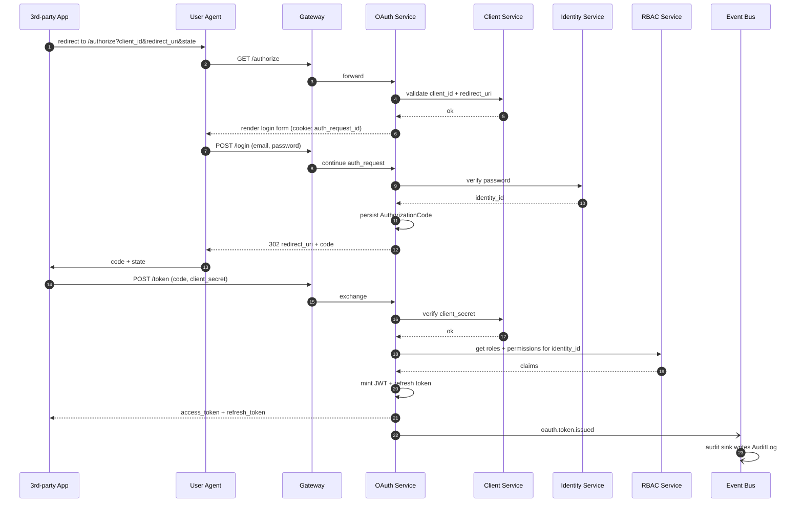
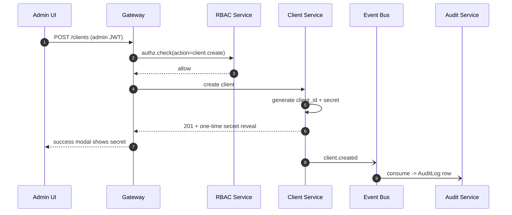
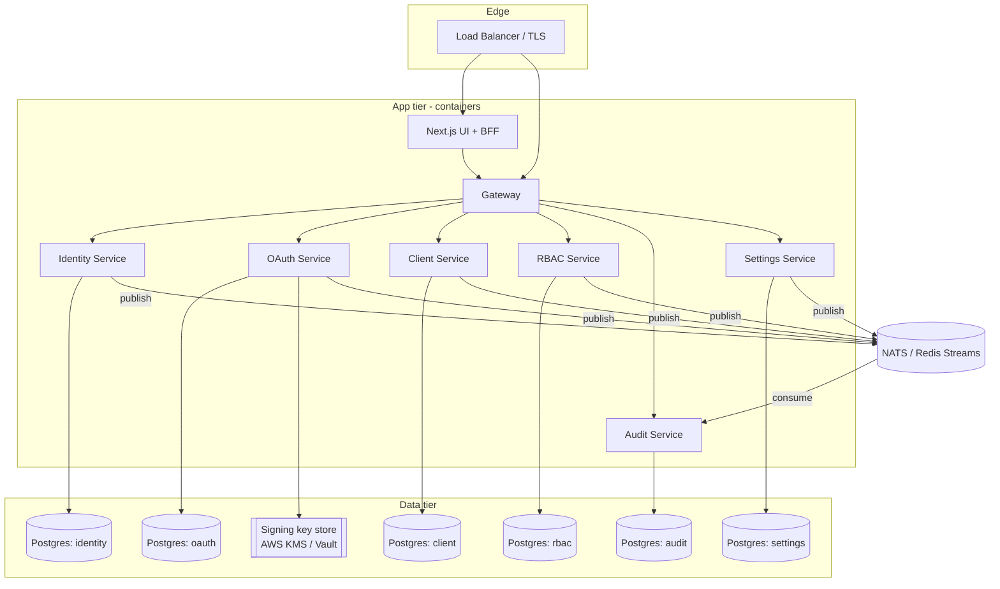

# SW-IDP — Microservices Architecture Proposal

This document proposes a microservices decomposition for the PoC based on the SRS + the screens in `design/REQUIREMENTS.md` and the data model in `design/ERD.md`.

> **Pragmatic note.** For a PoC at this scope, a **modular monolith** with the same module boundaries would ship faster and cost less to operate. This document assumes microservices are a hard requirement (e.g., team structure, deployability, or a path toward production). The "[Trade-offs](#trade-offs)" section at the bottom shows when to collapse each service back.

## 1. Design drivers

- **Single-sign-on read path must stay fast.** `/authorize` and `/token` are the hot paths — they should be able to scale independently from the admin dashboard.
- **Admin write path is low-traffic but high-sensitivity.** Client secret rotation, identity lifecycle, and role assignments all need a durable audit trail.
- **Audit must never block the business action.** Audit writes are async; a failing audit pipeline degrades observability, not functionality.
- **Each service owns its tables.** No cross-service joins. Shared concepts (an `identity_id` on an audit row) are carried as IDs, not foreign keys.
- **JWTs are the contract between services.** Resource servers validate tokens against the OAuth service's JWKS — no service-to-service "is this user allowed" round-trips on the hot path.

## 2. Service landscape

Six services + one BFF/API-gateway, fronted by the Next.js admin UI.



## 3. Service catalogue

| # | Service | Owns (from ERD) | Sync API surface | Key deps |
|---|---|---|---|---|
| 1 | **Identity Service** | `Identity`, `Session` | `POST /identities` (register), `POST /identities/:id/verify-password`, `GET /identities/:id`, `PATCH /identities/:id` (status, profile), `GET/DELETE /identities/:id/sessions` | Hashes passwords (Argon2id). |
| 2 | **OAuth Service** | `AuthorizationCode`, `AccessToken`, `RefreshToken`, signing keys | `GET /authorize`, `POST /token`, `POST /introspect`, `POST /revoke`, `GET /.well-known/jwks.json`, `GET /.well-known/openid-configuration`, `GET /userinfo` | Identity (password verify), Client (client + secret + redirect URI), RBAC (claims). |
| 3 | **Client Management Service** | `ClientApplication`, `RedirectUri` | Admin CRUD for clients + `POST /clients/:id/rotate-secret`; internal `POST /clients/:id/verify-secret`, `GET /clients/:id/redirect-uris` | — |
| 4 | **RBAC & Policy Service** | `Role`, `Permission`, `IdentityRole`, `RolePermission`, `AccessPolicy` | `GET/POST /roles`, `PUT /identities/:id/roles`, `POST /authz/check` (permission check), `GET/POST /policies` | — |
| 5 | **Audit Service** | `AuditLog` | `GET /audit-logs` (query + filter) — **no direct write API**; writes come only via the event bus | Consumes `*.audit` events from all services. |
| 6 | **Settings Service** | `SystemSetting` | `GET /settings`, `PUT /settings/:key`; broadcasts `settings.updated` events so other services can refresh cached values | — |
| G | **API Gateway / BFF** | none (stateless) | Terminates TLS, forwards to the right service, aggregates for the UI where useful, issues short-lived session cookies for the admin UI | All services. |

## 4. Data ownership — who writes what

No shared database. Each service has its own Postgres schema (or its own Postgres instance in a fuller deployment).



Cross-service IDs (e.g. `IdentityRole.identity_id` referencing Identity service's users) are carried by value, not by foreign key. Deletion is soft / eventually consistent.

## 5. Communication patterns

**Synchronous (HTTP / JSON, internal-only):**

- OAuth → Identity: verify the end-user's password at `/authorize`
- OAuth → Client: look up the client, validate `client_secret`, validate `redirect_uri`
- OAuth → RBAC: fetch the user's roles/permissions to embed in the JWT's claims
- Gateway → any service: proxy admin UI calls

**Asynchronous (event bus — NATS subjects / Redis Streams):**

- `identity.*` (created, enabled, disabled, login.success, login.failure, session.revoked)
- `client.*` (created, secret.rotated, deleted)
- `oauth.*` (token.issued, token.revoked, code.used)
- `rbac.*` (role.assigned, role.revoked, policy.updated)
- `settings.updated`

Every service fires fire-and-forget audit events on the bus. **Audit Service is the sole consumer** — it flattens them into `AuditLog` rows. A separate subscriber can feed observability tools later.

**Service-to-service auth:** mTLS internally, plus a short-lived JWT minted by the gateway (`aud: <service>`) for every call. In a PoC cluster, this can be simplified to shared secrets per pair.

## 6. Key flows

### 6.1 OAuth authorization code flow



### 6.2 Admin creates a client application



### 6.3 Admin rotates a client secret

Same shape as above; event is `client.secret.rotated`. The modal that exists in the design (`modal_secret_rotation_success`) is driven by the one-time secret returned by the Client Service.

## 7. Deployment topology (PoC)



For the very first PoC run, collapse Postgres into one instance with six schemas and run everything in a single Docker Compose project.

## 8. Cross-cutting concerns

- **Signing keys.** OAuth Service holds the JWT signing private key in KMS/Vault. The public JWKS is cached at the gateway and by any resource server.
- **Config & secrets.** 12-factor env vars via a secrets manager. Settings Service serves *product* settings (token TTLs, password rules) — not deployment secrets.
- **Observability.** OpenTelemetry traces propagated through the gateway (trace-id header). Logs to stdout, shipped to a single aggregator. Every inter-service call carries a request id.
- **Resilience.** Retries with jitter on the bus only; sync paths fail fast. OAuth's dependencies (Identity, Client, RBAC) are in the same trust boundary, so circuit breakers are optional for PoC.
- **Migrations.** Each service owns its own migrations under `services/<name>/migrations/`. A service is never allowed to write to another service's schema.
- **Local dev.** One `docker-compose.yaml` brings up all services, Postgres, NATS, and a fake SMTP for invite emails.

## 9. Suggested repo layout

```
SW-IDP/
├── apps/
│   └── web/              # Next.js UI + BFF (the ported Stitch screens)
├── services/
│   ├── identity/
│   ├── oauth/
│   ├── clients/
│   ├── rbac/
│   ├── audit/
│   └── settings/
├── packages/             # shared TS types, event schemas, auth SDK
│   ├── events/
│   └── auth-sdk/
├── infra/
│   ├── docker-compose.yaml
│   └── k8s/
└── design/               # existing (REQUIREMENTS.md, ERD.md, ARCHITECTURE.md, stitch-export/)
```

Language recommendation: **TypeScript across the board** (Node + Fastify for services) so event schemas and DTOs are shared in `packages/events` with zero translation cost. Swap specific services to Go later if performance on `/token` becomes a problem.

## 10. Trade-offs

| Concern | Microservices (this proposal) | Modular monolith (alternative) |
|---|---|---|
| Deploy complexity | 6+ containers, bus, per-service DB | 1 container, 1 DB |
| Scaling `/token` independently | ✅ trivial | Requires extraction |
| Team parallelism | ✅ clear ownership | Needs discipline on module boundaries |
| Distributed tracing / debugging | Needed day one | Not needed |
| Correctness of audit | Async, isolated | Same logical design, in-process events |
| Time-to-first-demo | Longer | Shorter |
| Cost to build for a PoC | High | Low |

**Pragmatic recommendation for the PoC:** start as a modular monolith *structured like this document* — one repo, one Next.js + Fastify app, six top-level modules mirroring the service names, one Postgres with six schemas, in-process event emitter. When a real driver appears (team split, `/token` scaling, separate release cadence), extract one service at a time. The module boundaries above are deliberately chosen so each extraction is mechanical.

## 11. Open questions

1. **Language.** TypeScript across the board (matches the UI), or polyglot (Go for hot paths)?
2. **Event bus.** NATS, Redis Streams, or Kafka? NATS is the easiest PoC choice.
3. **Gateway form.** Use Next.js Route Handlers as the BFF and skip a separate gateway, or put Kong/Envoy in front for production-parity?
4. **Session model for admin UI.** Short-lived JWT cookie issued by the gateway (stateless), or a classic opaque session in the Identity Service (stateful, easy revocation)?
5. **Public clients (PKCE).** Are SPA/mobile clients in scope for the PoC, or only confidential clients? Affects whether `code_challenge` columns on `AuthorizationCode` get used.
