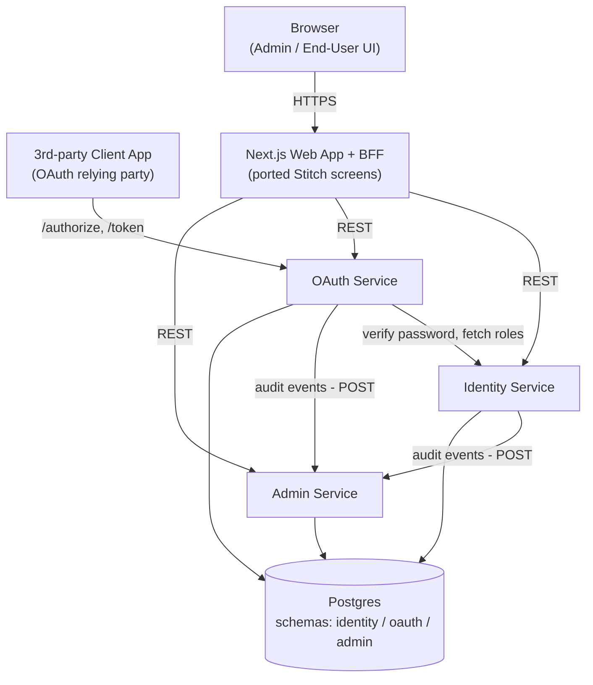
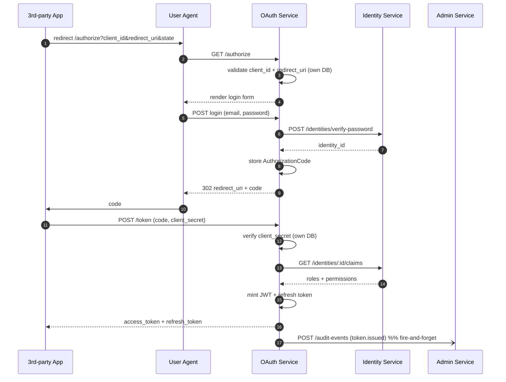

# SW-IDP — Microservices Architecture (Simple)

Minimum-viable microservices split for the PoC. Microservices is a hard requirement, so we don't go monolith — but everything that doesn't earn its keep (event bus, separate gateway, per-service DB, KMS, service mesh) is cut. If we need any of it later, the boundaries below are drawn so it can be added without a rewrite.

## 1. Three services

| # | Service | Owns (from ERD) | Why this boundary |
|---|---|---|---|
| 1 | **Identity Service** | `Identity`, `Session`, `Role`, `Permission`, `IdentityRole`, `RolePermission`, `AccessPolicy` | "Who you are, and what you're allowed to do." Login/register, RBAC, policies — all tightly coupled around a user, so they live together. |
| 2 | **OAuth Service** | `ClientApplication`, `RedirectUri`, `AuthorizationCode`, `AccessToken`, `RefreshToken` | The `/authorize` + `/token` hot path plus everything it needs (clients, redirect URIs, token lifecycle). Independently scalable later. |
| 3 | **Admin Service** | `AuditLog`, `SystemSetting` | Low-traffic admin-only concerns that the other two shouldn't own. Audit sink lives here so no service logs audits into its own DB. |

Plus the **Next.js web app** (the ported Stitch UI) which doubles as the BFF — it calls the three services directly. No separate API gateway.

## 2. System diagram



## 3. Data — one Postgres, three schemas

Each service writes only to its own schema:

- `identity.*` — users, sessions, roles, permissions, identity_roles, role_permissions, access_policies
- `oauth.*` — clients, redirect_uris, authorization_codes, access_tokens, refresh_tokens
- `admin.*` — audit_logs, system_settings

Cross-schema IDs (e.g. `oauth.access_tokens.identity_id` points at `identity.identities.id`) are **carried by value, no foreign keys**. When we need full DB isolation later, we give each schema its own instance and change nothing else.

## 4. How services talk

**Everything is synchronous HTTP + JSON.** No event bus, no queues.

- **Web → any service**: normal REST, gets a short-lived admin session cookie from Identity at login.
- **OAuth → Identity**: two calls in the code flow — `POST /identities/verify-password` and `GET /identities/:id/claims` (roles + permissions to embed in the JWT).
- **Identity → Admin** and **OAuth → Admin**: `POST /audit-events` after any state change. Best-effort: if Admin is down, the caller logs the event to stdout and continues — audit gaps are tolerated in the PoC.

Service-to-service auth: a shared internal secret in a header (`X-Internal-Auth: <secret>`), rotated via env var. No mTLS, no JWT mint, no service mesh.

## 5. OAuth authorization code flow — three services



## 6. Deployment — one docker-compose, four containers

```yaml
# infra/docker-compose.yaml (sketch)
services:
  postgres:       # single instance, three schemas
  identity:       # node:20 + fastify
  oauth:          # node:20 + fastify
  admin:          # node:20 + fastify
  web:            # next.js, talks to the three services by compose hostname
```

Five containers including Postgres. That's the whole deployment.

## 7. Repo layout

```
SW-IDP/
├── apps/
│   └── web/              # Next.js + ported Stitch screens (BFF lives here)
├── services/
│   ├── identity/         # own migrations for identity.*
│   ├── oauth/            # own migrations for oauth.*
│   └── admin/            # own migrations for admin.*
├── packages/
│   └── shared/           # TS types, DTOs, small http client helpers
├── infra/
│   └── docker-compose.yaml
└── design/               # existing
```

Language: **TypeScript + Fastify** everywhere. Shared DTOs in `packages/shared` so the web BFF and the services speak the same types with no translation.

## 8. What we're deliberately not doing, and when to add it back

| Cut | Why we're not doing it now | When to add it |
|---|---|---|
| Event bus (NATS/Kafka) | Sync `POST /audit-events` is 5 lines of HTTP | When a second consumer of service events appears (e.g. metrics, webhooks to client apps) |
| API Gateway (Kong/Envoy) | Next.js BFF already does routing + auth | When non-Next.js clients (mobile, CLI) need a public entry point |
| DB per service | One Postgres keeps ops trivial; schema-per-service preserves the boundary | When one service's write load affects another, or for strict isolation/compliance |
| KMS / Vault for signing keys | JWT keypair in env var; JWKS served from a static file per OAuth pod | Before production, always. In PoC, no. |
| Service mesh / mTLS | Shared-secret header is enough inside one compose network | When services run across trust boundaries |
| Distributed tracing | stdout logs + a `request_id` header is enough for three services | When debugging a flow takes more than a grep |
| RBAC/Policy as its own service | Lives inside Identity — it's always called alongside identity lookups | When policy evaluation becomes hot enough to scale independently |

## 9. Open questions

1. **Language.** TypeScript + Fastify across the three services (my default) — OK, or a different stack?
2. **Admin session model.** Cookie-based opaque session issued by Identity Service (easy revoke, stateful) vs short-lived JWT cookie (stateless). My default: opaque session.
3. **PKCE.** Required for public clients, or confidential only? Affects whether `code_challenge` columns get exercised.
4. **Password rules / lockout.** Implemented in Identity or driven by `SystemSetting` values owned by Admin? (Admin owns the settings table; Identity reads them.)
