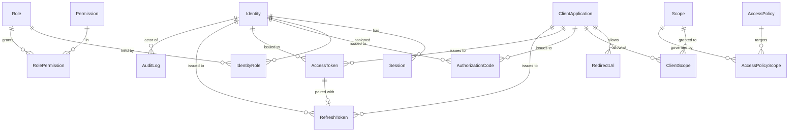
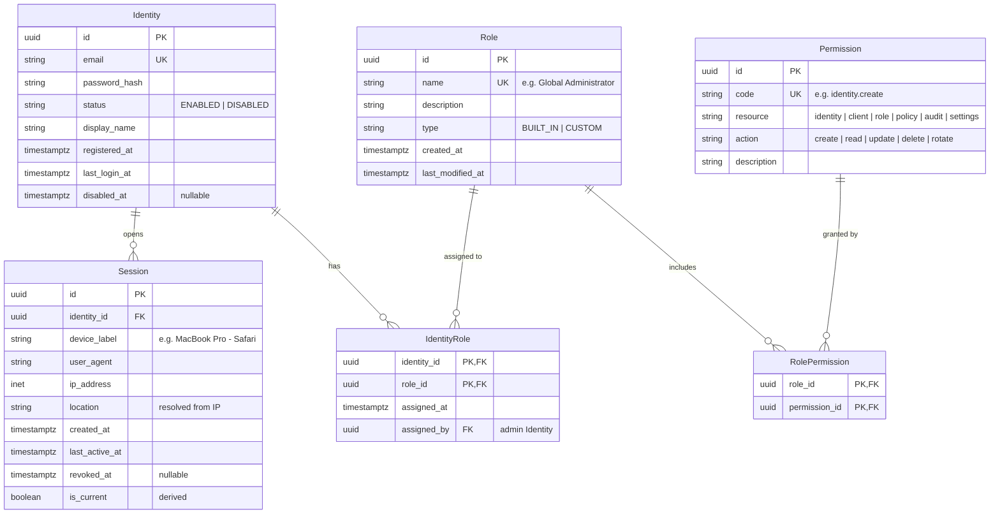
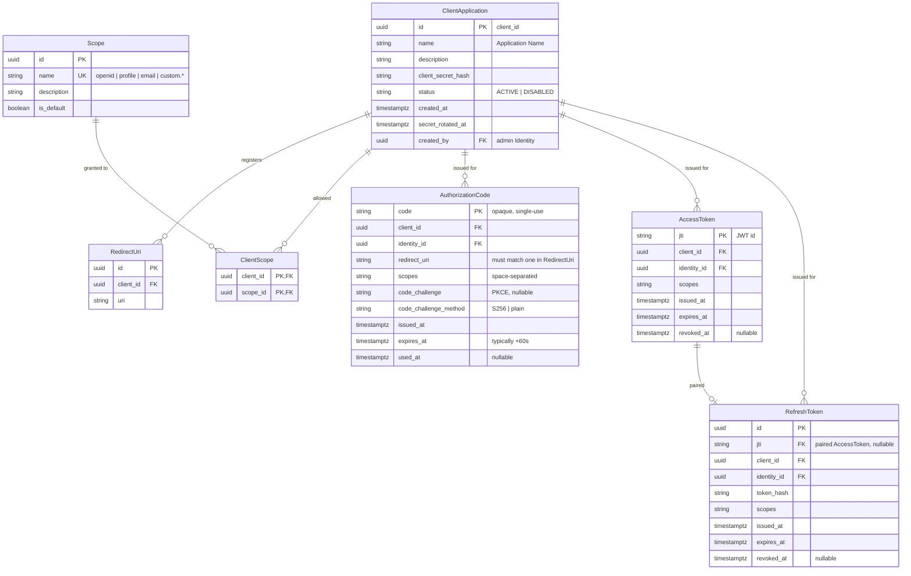
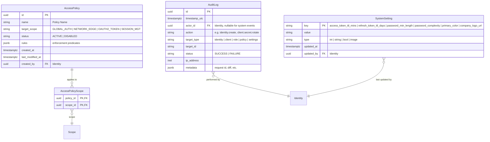

# SW-IDP — Entity Relationship Diagrams

Derived from `design/REQUIREMENTS.md` (SRS + Stitch design). Four diagrams: a full-model overview, then three zoomed views.

Assumptions baked into the model:

- **Admin vs. end-user is a role, not a separate entity.** The SRS distinguishes "Identity" from "Identity Admin", but since the design already introduces RBAC with a `Global Administrator` role, admins are modelled as `Identity` rows that hold that role. This avoids duplicate user tables.
- **Tokens are stored for revocation/audit.** Access tokens are JWTs (self-contained), but we persist a row per issuance so "Rotate Secret", revoke-on-logout, and audit trails work.
- **`RedirectUri` is its own table** because `admin_create_edit_client` shows multiple URIs per client.
- **Scopes** are a first-class entity (`openid`, `profile`, `email`, custom). Clients are allowlisted to scopes; access policies target scopes.
- Surrogate `uuid` PKs everywhere. Timestamps are `timestamptz`.

---

## 1. Full model — overview

---

## 2. Identity & Access (RBAC + sessions)

---

## 3. OAuth 2.0 Authorization Server

---

## 4. Governance — Access Policies, Audit Logs, Settings

---

## Field provenance (where each field came from)

| Entity | Fields backed by a screen / SRS |
|---|---|
| `Identity` | SRS §2.1 (email/password, enable/disable); `admin_identity_management` table columns (User Entity, Status, Registration Date, Access Control) |
| `Session` | `user_profile_sessions_2` table (Device/Application, Location (IP), Last Active, Action) |
| `Role` | `admin_access_policies_1` (Role Name, Description, Assigned Identities); `admin_role_management` adds Type (Built-in/Custom) + Last Modified |
| `ClientApplication` + `RedirectUri` | `admin_create_edit_client` (Application Name, Redirect URIs, Client ID, Client Secret); `admin_client_management` table |
| `Scope` | `admin_access_policies_2` (OAuth 2.0 Scopes: openid, profile, email) |
| `AccessPolicy` | `admin_access_policies_2` (Policy Name, Target Scope, Status + values GLOBAL_AUTH / NETWORK_EDGE / OAUTH2_TOKEN / SESSION_MGT) |
| `AuditLog` | `admin_audit_logs` table (Timestamp UTC, Actor, Action/Event, Status, IP Address) |
| `SystemSetting` | `admin_system_settings` (Access Token Expiration, Refresh Token Expiration, Password Complexity, Min Password Length, Primary Color, Company Logo) |
| `AuthorizationCode` / `AccessToken` / `RefreshToken` | SRS §2.2 (authorize + token endpoints, JWT) — fields are OAuth 2.0 spec standards |

## Open modelling questions (flag before Step 2)

1. **Permission seeding.** Should `Permission` be a static enum in code (simpler) or a table you can grow from the UI (more flexible but needs a management screen that doesn't exist in the design)? Default: static enum, but tracked in DB so `RolePermission` FKs are valid.
2. **PKCE.** Do we require PKCE for public clients (mobile/SPA), or only support confidential clients? The design doesn't say. Default: support both, make PKCE optional at the code-challenge columns.
3. **Multi-tenant?** Nothing in the SRS or design suggests tenants/orgs. Model assumes single-tenant.
4. **Policy rules schema.** `AccessPolicy.rules` is `jsonb` today. If the UI ever gets a rules editor, we'll need a stricter schema (allow/deny list, conditions). Leaving flexible for PoC.
