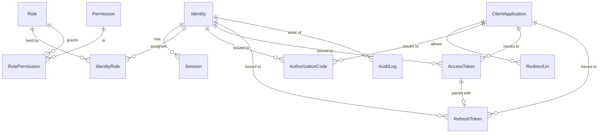
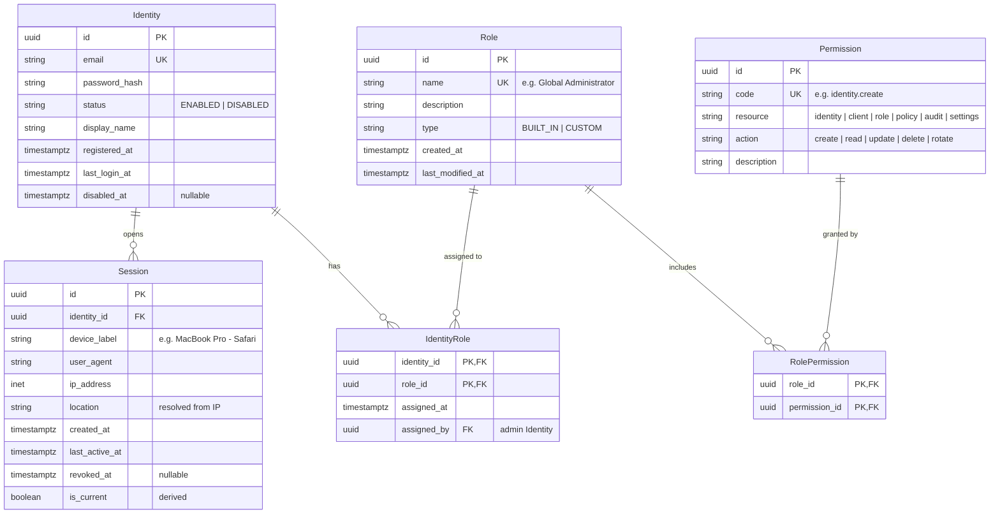
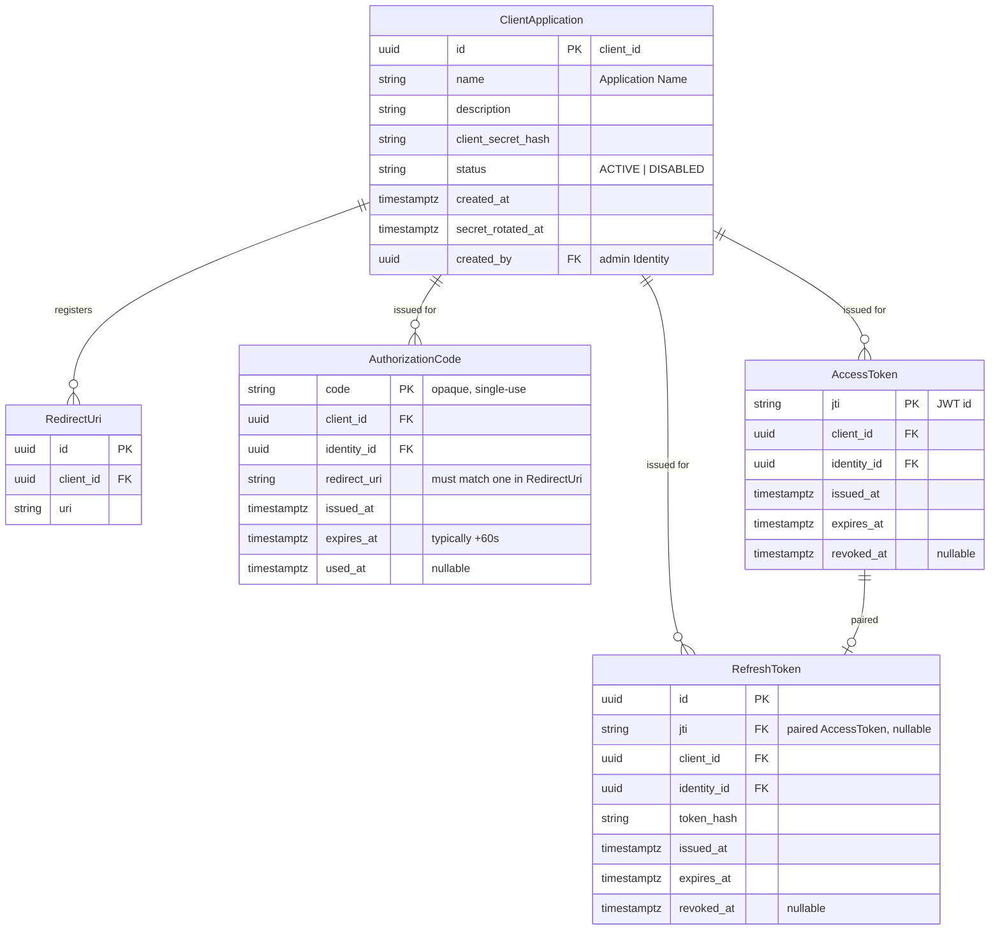
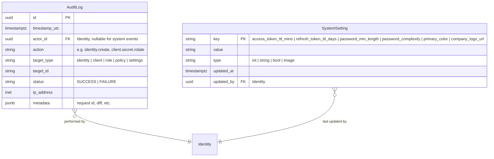

# SW-IDP — Entity Relationship Diagrams

Derived from `design/REQUIREMENTS.md` (SRS + Stitch design). Four diagrams: a full-model overview, then three zoomed views.

Assumptions baked into the model:

- **Admin vs. end-user is a role, not a separate entity.** The SRS distinguishes "Identity" from "Identity Admin", but since the design already introduces RBAC with a `Global Administrator` role, admins are modelled as `Identity` rows that hold that role. This avoids duplicate user tables.
- **Tokens are stored for revocation/audit.** Access tokens are JWTs (self-contained), but we persist a row per issuance so "Rotate Secret", revoke-on-logout, and audit trails work.
- **`RedirectUri` is its own table** because `admin_create_edit_client` shows multiple URIs per client.
- **OAuth scopes are out of scope for the PoC.** No `Scope` entity, no per-client scope allowlist, no scopes field on tokens/codes. See `design/STACK.md` ("Out of scope").
- **Access Policies are out of scope.** No `AccessPolicy` entity, no policy table, no policy endpoints. Policy-shaped requirements are absorbed by role management (`Role` + `Permission` + `RolePermission`). See `STACK.md`.
- **PKCE is out of scope.** `AuthorizationCode` does not carry `code_challenge` / `code_challenge_method`. See `STACK.md`.
- Surrogate `uuid` PKs everywhere. Timestamps are `timestamptz`.

---

## 1. Full model — overview

---

## 2. Identity & Access (RBAC + sessions)

---

## 3. OAuth 2.0 Authorization Server

---

## 4. Governance — Audit Logs, Settings

---

## Field provenance (where each field came from)

| Entity | Fields backed by a screen / SRS |
|---|---|
| `Identity` | SRS §2.1 (email/password, enable/disable); `admin_identity_management` table columns (User Entity, Status, Registration Date, Access Control) |
| `Session` | `user_profile_sessions_2` table (Device/Application, Location (IP), Last Active, Action) |
| `Role` | `admin_role_management` (Role Name, Description, Type, Last Modified); `admin_create_edit_role` (Permissions picker) |
| `ClientApplication` + `RedirectUri` | `admin_create_edit_client` (Application Name, Redirect URIs, Client ID, Client Secret); `admin_client_management` table |
| `AuditLog` | `admin_audit_logs` table (Timestamp UTC, Actor, Action/Event, Status, IP Address) |
| `SystemSetting` | `admin_system_settings` (Access Token Expiration, Refresh Token Expiration, Password Complexity, Min Password Length, Primary Color, Company Logo) |
| `AuthorizationCode` / `AccessToken` / `RefreshToken` | SRS §2.2 (authorize + token endpoints, JWT) — fields are OAuth 2.0 spec standards |

## Open modelling questions

1. **Permission seeding.** Should `Permission` be a static enum in code (simpler) or a table you can grow from the UI (more flexible but needs a management screen that doesn't exist in the design)? Default: static enum, but tracked in DB so `RolePermission` FKs are valid.
2. ~~**PKCE.**~~ **Resolved: dropped.** See `design/STACK.md`.
3. **Multi-tenant?** Nothing in the SRS or design suggests tenants/orgs. Model assumes single-tenant.
4. ~~**Policy rules schema.**~~ **Resolved: AccessPolicy dropped from the PoC.** Policy-shaped requirements are absorbed by `Role` + `Permission`. See `STACK.md`.
